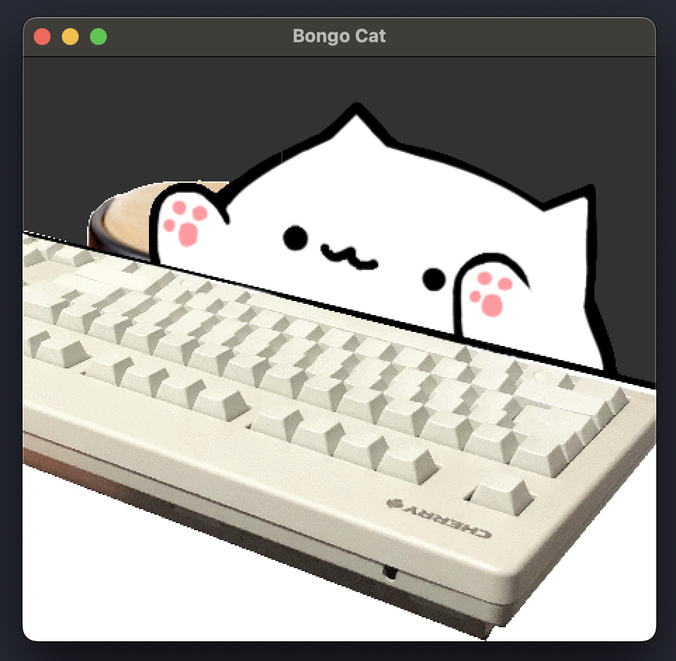
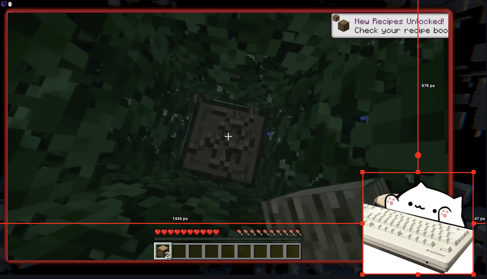

# Bongo Cat for macOS

A cute animated cat that bongs along to your typing! This macOS application displays an adorable cat animation that responds to your keyboard input in real-time.



## 🚀 Quick Start

### Prerequisites
Install Python and required dependencies:

```bash
brew install python
pip3 install PyQt6 pyobjc-framework-ApplicationServices
```

### Running the Application
```bash
python3 main.py
```

## ⚠️ Important Setup

**Accessibility Permissions Required**: Make sure the terminal you're running the script from has accessibility access in macOS settings:

1. Go to **System Settings** > **Privacy & Security** > **Accessibility**
2. Add your terminal application (Terminal.app, iTerm2, VS Code, etc.)
3. Enable the checkbox for your terminal

Without this permission, the keystroke detection won't work!

## ⚙️ Customization

### Window Settings
You can customize the appearance by changing the constants at the beginning of `main.py`:

```python
ALWAYS_ON_TOP = False    # Set to True to keep window always visible
REMOVE_DECORATIONS = False    # Set to True for transparent background
```

### Custom Themes
Create your own Bongo Cat themes by making custom `.gif` images! 

**Switching Themes**: Change the `THEME` constant in `main.py` to use different themes:
```python
THEME = "default"    # Use the default theme
THEME = "nyao"       # Use the nyao theme
THEME = "your_theme" # Use your custom theme
```

**Creating New Themes**: The naming convention for theme files is:
- `00.gif` - Default state          ( no keys pressed )
- `01.gif` - Right hand active      ( inner keys )
- `02.gif` - Right hand active      ( outer keys )
- `10.gif` - Left hand active       ( outer keys )
- `11.gif` - Both hands active      ( innet + outer keys )
- `12.gif` - Both hands active      ( outer keys )
- `20.gif` - Left hand active       ( inner keys )  
- `21.gif` - Both hands active      ( inner keys )
- `22.gif` - Both hands active      ( outer + inner keys )

Place your custom `.gif` files in a new folder under `img/your_theme_name/`. The application already includes two themes: `default` and `nyao`. If you create awesome themes, don't hesitate to share them with the community!

### Streaming with OBS


Perfect for streamers! The application works great as an overlay in OBS Studio. Set `REMOVE_DECORATIONS = True` and `ALWAYS_ON_TOP = True` for the best streaming experience.

## 🚧 Current Limitations

- No mouse tracking
- No microphone/mouth movement tracking
- macOS only

## 🙏 Credits

This project was inspired by [mac-typing-bongo-cat](https://github.com/111116/mac-typing-bongo-cat) (default images taken from this project), but remastered to use PyQt6 instead of Tkinter for better performance and modern MacOS compatibility.
## 📝 License

Feel free to use, modify, and share this project!

---

**Enjoy your new typing companion! 🐱**