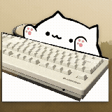

# Bongo Cat for macOS

A cute animated cat that bongs along to your typing! This macOS application displays an adorable cat animation that responds to your keyboard input in real-time.



## 🚀 Quick Start

### Prerequisites
Install Python and required dependencies:

```bash
brew install python
pip3 install PyQt6 pyobjc-framework-ApplicationServices
```

### Running the Application
```bash
python3 main.py
```

## ⚠️ Important Setup

**Accessibility Permissions Required**: Make sure the terminal you're running the script from has accessibility access in macOS settings:

1. Go to **System Settings** > **Privacy & Security** > **Accessibility**
2. Add your terminal application (Terminal.app, iTerm2, VS Code, etc.)
3. Enable the checkbox for your terminal

Without this permission, the keystroke detection won't work!

## ⚙️ Customization

### Configuration Setup
The application uses a `settings.env` file for configuration, which allows you to customize settings without affecting the git repository.

1. **First time setup**: Copy the example configuration:
   ```bash
   cp settings.env.example settings.env
   ```

2. **Edit your settings**: Open `settings.env` and modify the values:
   ```bash
   # Window settings
   ALWAYS_ON_TOP=false          # Keep window always on top (true/false)
   REMOVE_DECORATIONS=true      # Remove window decorations for transparency (true/false)
   
   # Appearance settings
   THEME=default                # Theme folder name (default, nyao, or custom)
   SCALE=1                      # Scale factor for window size (1 = original size)
   ```

3. **Live reload**: Press **Ctrl+R** (or **Cmd+R**) while the application is running to reload your settings instantly! No need to restart the application.

### ⌨️ Keyboard Shortcuts
While the application is running, you can use these keyboard shortcuts:

- **Ctrl+H** (or **Cmd+H**): Show/hide help overlay with all shortcuts
- **Ctrl+R** (or **Cmd+R**): Reload settings from `settings.env`
- **Ctrl+U** (or **Cmd+U**): Upscale - increase size by 0.1
- **Ctrl+D** (or **Cmd+D**): Downscale - decrease size by 0.1  
- **Ctrl+T** (or **Cmd+T**): Cycle through available themes


All changes are automatically saved to your `settings.env` file!

### Configuration Options
- **Always on Top**: When enabled, the Bongo Cat window stays above all other windows
- **Remove Decorations**: Creates a frameless, transparent window. When enabled, you can click and drag the cat around your screen since there's no title bar to grab
- **Theme**: Choose which theme folder to use for animations (see Custom Themes section below)
- **Scale**: Adjust the size of the Bongo Cat. Perfect for fitting it in a corner or making it more prominent on your screen (0.5 = half size, 2 = double size, etc.)

### Custom Themes
Create your own Bongo Cat themes by making custom `.gif` images! 

**Switching Themes**: Change the `THEME` setting in your `settings.env` file:
```bash
THEME=default      # Use the default theme
THEME=nyao         # Use the nyao theme  
THEME=your_theme   # Use your custom theme
```
Then press **Ctrl+R** (or **Cmd+R**) to reload and see your new theme instantly!

**Creating New Themes**: The naming convention for theme files is:
- `00.gif` - Default state          ( no keys pressed )
- `01.gif` - Right hand active      ( inner keys )
- `02.gif` - Right hand active      ( outer keys )
- `10.gif` - Left hand active       ( outer keys )
- `11.gif` - Both hands active      ( innet + outer keys )
- `12.gif` - Both hands active      ( outer keys )
- `20.gif` - Left hand active       ( inner keys )  
- `21.gif` - Both hands active      ( inner keys )
- `22.gif` - Both hands active      ( outer + inner keys )

Place your custom `.gif` files in a new folder under `img/your_theme_name/`. The application already includes two themes: `default` and `nyao`. If you create awesome themes, don't hesitate to share them with the community!

### Streaming with OBS


Perfect for streamers! The application works great as an overlay in OBS Studio. For the best streaming experience:

1. Set your `settings.env` configuration:
   ```bash
   REMOVE_DECORATIONS=true
   ALWAYS_ON_TOP=true
   SCALE=0.8                    # Adjust size to fit your layout
   ```

2. Press **Ctrl+R** (or **Cmd+R**) to apply changes instantly while streaming

You can also adjust the `SCALE` in real-time to make the cat smaller or larger to fit your streaming layout perfectly without interrupting your stream!

## 🚧 Current Limitations

- No mouse tracking
- No microphone/mouth movement tracking
- macOS only

## 🙏 Credits

This project was inspired by [mac-typing-bongo-cat](https://github.com/111116/mac-typing-bongo-cat) (default images taken from this project), but remastered to use PyQt6 instead of Tkinter for better performance and modern MacOS compatibility.
## 📝 License

Feel free to use, modify, and share this project!

---

**Enjoy your new typing companion! 🐱**